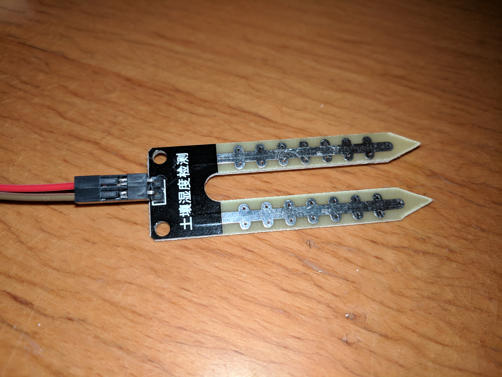
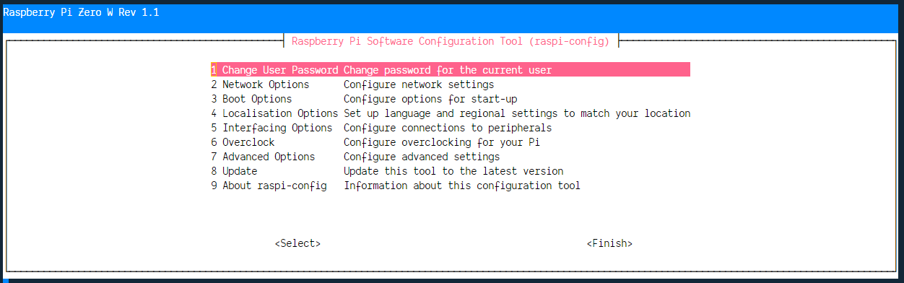
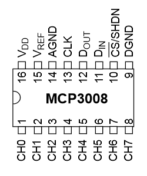
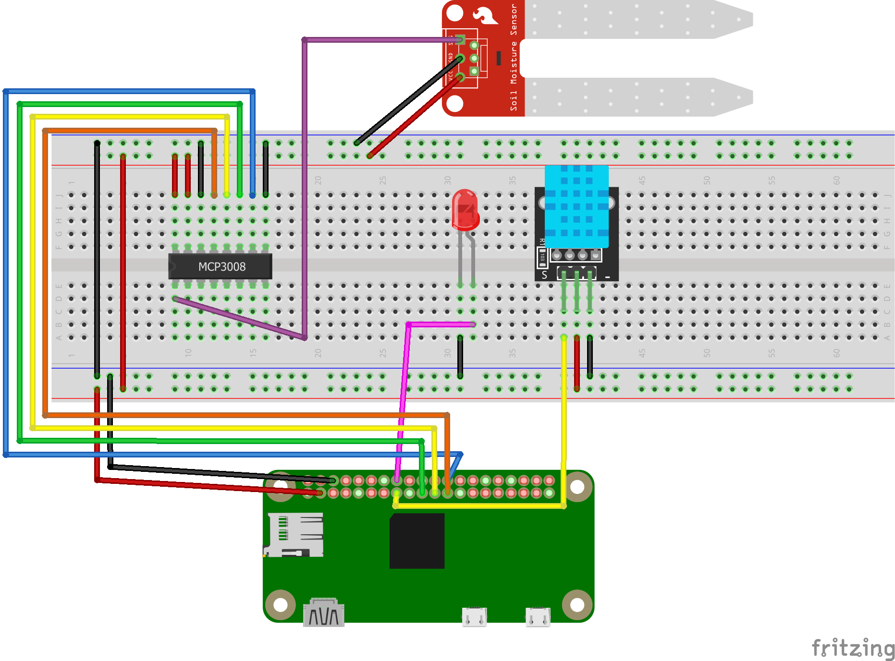

The course is coming slowly to an end, so it's time to bring all knowledge
together and start building something useful. The goal is to have a little
greenhouse to put on your window ledge, connected to sensors so you will get
notified when it gets too hot/cold inside or the plants need new water.

The Raspberry Pi and the program running on it already is capable of reading the
temperature and humidity values which are both important environmental values to
grow plants. But till now it's not possible to have any information about the
soil and how much water is left. To measure the moisture of the soil there are
simple sensors available, basically two metal pieces which are put in the ground
to measure the electric conductivity.



Using this sensor brings another problem to the table, the Raspberry Pi doesn't
have any analog-in pins. So to measure analog values you have to use an
analog-digital-converter (ADC). In this Example I will use the MCP3008 chip
which can be connected to the RasPi via the
[Serial Peripheral Interface (SPI) bus](https://en.wikipedia.org/wiki/Serial_Peripheral_Interface).
SPI is deactivated by default so connect to your Raspberry Pi via ssh and run
the `raspi-config` command with admin privileges:

```bash
sudo raspi-config
```



In the menu choose the `Interfacing Options` and activate SPI.

When SPI is enabled you can start wiring the `MCP3008` chip to the Raspberry Pi.
For orientation the chip has a small dent on one side. When aligned with the
dent pointing to the left, the SPI connectors are on the top and the analog
input pins are on the bottom.



```
VDD   3.3V
VREF  3.3V
AGND  GROUND
CLK   BCM11(SCLK) Physical pin 23
DOUT  BCM09(MISO) Physical pin 21
DIN   BCM10(MOSI) Physical pin 19
CS    BCM08(CE0)  Physical pin 24
DGND  GROUND
```

With the complete SPI bus connected you can use the other side of the MCP3008 to
connect an analog input from a soil moisture sensor:



Now the only missing part is a little bit of software to collect the values and
send them to the cloud. Like always with a node.js program the first step is
choosing a library to make it as easy as possible to work with the SPI. This
time the package of choice is
[mcp-spi-adc](https://www.npmjs.com/package/mcp-spi-adc), start by running
`npm install mcp-spi-adc` on the Raspberry Pi inside the directory of the
firebase sensor project.

The following code snippet will read the analog input value on the pin `0` in an
interval of 5 seconds:

```js
const mcpadc = require('mcp-spi-adc')

const analogPin = 0

const analogInput = mcpadc.open(analogPin, error => {
  if (error) {
    console.error('error on initializing spi', error)
    throw error
  }
  setInterval(() => {
    analogInput.read((error, reading) => {
      if (error) {
        console.error('error on reading the analog input', error)
      }

      console.log('analog input value', reading.value, reading.rawValue)
    })
  }, 5000)
})
```

### Tasks

- activate the SPI bus on the Raspberry Pi
- connect the MCP3008 chip to the Raspberry Pi via SPI
- complete the wiring to connect a soil moisture sensor
- read the soil moisture values and store them in the firestore
