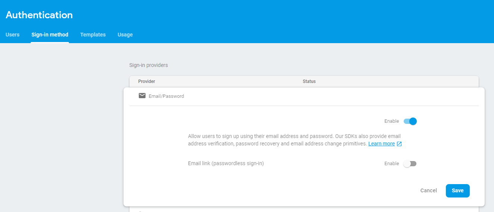

In the last session we connected a soil moisture sensor to the cloud and can
collect its data now. But these values are not very useful without any reference
value to tell it stands for dry or wet soil. Because this reference value
depends on the type of soil you are using (mineral content, density,...) and the
actual sensor, this value should not be hard coded and easy to change. That's
why today we will add an interface to configure the reference value of dry soil.
In the next and last session we will add a firebase function to trigger an
action to tell you that you have to water the plants again.

As soon as you write data to a database with a form over the internet you should
protect your database by authentication. With firebase you can do this by
editing the rules to access the firestore. Instead of just setting it to false,
like the last time for write access, you can can check if `request.auth.uid` is
not equal `null` so the request comes from any authenticated user. If you want
to limit access to only one specific account you can also check for one specific
user id.

```
service cloud.firestore {
  match /databases/{database}/documents {
    match /{document=**} {
      allow write: if request.auth.uid != null;
      allow read: if request.auth.uid != null;
    }
  }
}
```

Now you have to implement an authentication mechanism in the web app, which is
fortunately done at the largest part by the
[firebaseui-web](https://github.com/firebase/firebaseui-web) package and with
react you can use
[firebaseui-web-react](https://github.com/firebase/firebaseui-web-react). To use
this there is a prerequisite, you have to enable an authentication mechanism



and create an account.


To get the actual authentication capabilities in the web app you have to add the
`firebase/auth` package to the other firebase imports:

```js
import firebase from 'firebase/app'
import 'firebase/firestore'
import 'firebase/auth'
```

With the auth package you can get the authentication state by subscribing to
with the `onAuthStateChanged` function:

```js
...
  componentDidMount() {
    this.unsubscribe = firebase.auth().onAuthStateChanged(
      user => {
        this.setState({ user })
      }
    )
  }
...
```

In the render method of the App component you now can render conditionally the
sign in view or the actual app content:

```js
import firebase from 'firebase/app'
import 'firebase/firestore'
import 'firebase/auth'
import FirebaseAuth from 'react-firebaseui/StyledFirebaseAuth'
...
...
  render() {
    return (
      <div>
        <header>
          <h1>My Greenhouse</h1>
        </header>
        {this.state.user ? (
          <AppContent />
        ) : (
            <FirebaseAuth
              uiConfig={{
              signInOptions: [firebase.auth.EmailAuthProvider.PROVIDER_ID]
            }}
              firebaseAuth={firebase.auth()}
            />
        )}
      </div>
    )
  }
...
```

With the authentication done, the next step is to actually set the reference
value that will be used to determine if the soil is dry or wet. To safe a value
with the key `dryReference` in the collection `settings` on the document
`soilData` you can use the following snippet:

```js
const updateDryReference = firestore =>
  // debounce the actual update function to save database writes
  debounce(dryReference => {
    firestore
      .collection('settings')
      .doc('soilData')
      .set({ dryReference })
  }, 250)
```

According to updating a value you can of course again subscribe to the changes:

```js
const subscribeToReferenceValue = (firestore, onUpdate) => {
  return firestore
    .collection('settings') // choose the collection of your data
    .doc('soilData') // choose the document
    .onSnapshot(documentSnapshot => {
      if (documentSnapshot.exists) {
        // read the actual data and give it to the onUpdate function
        onUpdate(documentSnapshot.data().dryReference)
      }
    })
}
```

With the `Slider` component from the `@material-ui/lab/Slider` package you can
create a slider UI to change the value stored in the firestore

```js
...
  render() {
    return (
      <div className="dry-reference-form">
        <p>Dry Reference: {this.state.dryReference.toFixed(2)}</p>
        <Slider
          min={0}
          max={1}
          step={0.05}
          value={this.state.dryReference}
          onChange={(_, dryReference) => {
            this.setState({ dryReference },
              // after setting the local state send
              // the new value to the remote data store
            () => {
              this.updateRemoteDryReference(dryReference)
            })
          }}
        />
      </div>
    )
  }
...
```

### Tasks

- protect the firestore data access to authenticated users only, or your account
- extend the data visualization app with authentication
- implement a component to control the `dryReferenceValue`

For a sample implementation you can look at:
[github.com/kaoDev/kalleott.de/tree/master/samples/greenhouse](https://github.com/kaoDev/kalleott.de/tree/master/samples/greenhouse)
