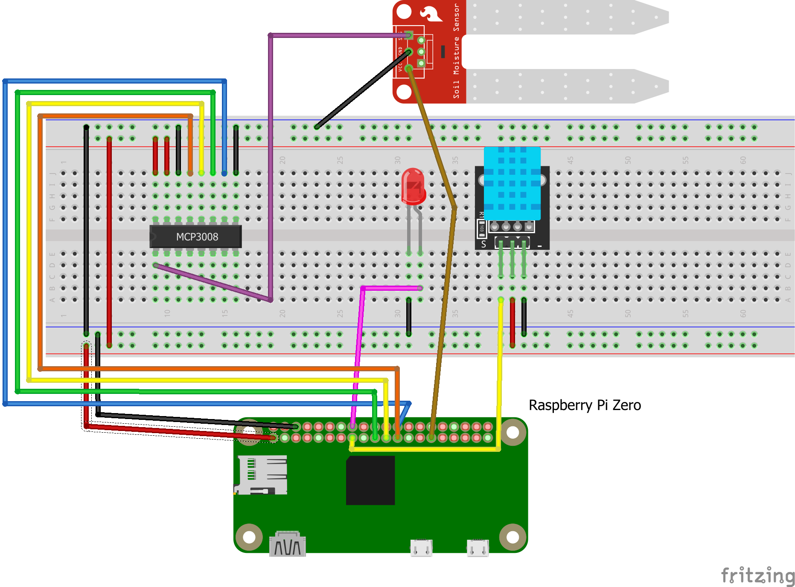

This is the last session and finishes the greenhouse project. The most parts are
already done, but one important part is still missing. The application should
send a message whenever the plants run dry. To do so you can use the google
cloud functions integrated in firebase.

The finished code can be cloned from this git repository:
[greenhouse](https://github.com/kaoDev/greenhouse)

## Serverless Code

To add cloud functions to your project you can init a project in the `functions`
directory with the command `firebase init`. This project has a main index.js
file and every exported function (`exports.functionName`) is deployed as a
firebase function.

The `firebase-functions` package provides many helper functions for example to
subscribe to changes in the firestore database. With this you can trigger a
cloud function call whenever a new sensor value is created in the database:

```js
const functions = require('firebase-functions')

exports.checkIfPlantsAreDryOnSensorChange = functions.firestore
  .document('/soilMoistureData/{eventId}')
  .onCreate(async snap => {
    const sensorValue = snap.data().value

    const reference = await getDryReferenceValue()

    updateIsDry(sensorValue, reference)
  })
```

To learn more take a look in the
[functions/index.js](https://github.com/kaoDev/greenhouse/blob/master/functions/index.js)
file from the [greenhouse repository](https://github.com/kaoDev/greenhouse)

Emails are send with the package [nodemailer](https://nodemailer.com/about/), it
provides a simple API to use your gmail account as a sender.

## Device Code

The code running on the Raspberry Pi got some changes since the last session,
the default interval to read the sensor values got increased from 5 minutes to
30 minutes to reduce some noise in the diagrams. And to reduce the wear on the
soil sensors the current is only set on them during the measure time. When those
sensors are embedded in soil and under constant voltage the corrosion is very
strong. So also the wiring changed a bit:



The program is located in the `device/index.js` file. It can be started with 2
arguments, the interval in milliseconds (`-interval 60000` or `--verbose 60000`)
in which the sensors should trigger and a verbose (`-v` or `--verbose`) flag for
more logging. The default interval is 1800000 which is equivalent to 30 minutes.

```
node index.js -v -i 5000
```

**Hint:** it is useful to configure the node.js program as a system service so
it starts automatically on startup. You can follow this
[nodesource tutorial](https://nodesource.com/blog/running-your-node-js-app-with-systemd-part-1/)

## UI Code

The UI code was not changed till the last session, it is the main project in the
[greenhouse repository](https://github.com/kaoDev/greenhouse), react based and
enables the user to see the current sensor states and control the reference
value for dry soil.

## Open ToDos to get started with your own application

- clone the repository
  - `git clone git@github.com:kaoDev/greenhouse.git`
- install firebase-tools:
  - `npm install -g firebase-tools`
- login with the firebase tools
  - `firebase login`
- connect to an existing firebase project
  - `firebase use`
- change firebase API keys and URLs to use your own project

This application uses an gmail account to send emails to listed users in the
`users` collection when the soil gets dry. So you need to use an existing
account or create a new one. To enable the cloud functions to send emails you
must set 2 environment variables for firebase:

```bash
firebase functions:config:set gmail.email=aGmailAccount@gmail.com
firebase functions:config:set gmail.password=thePasswordForThisAccount
```

To deploy the application start with building the UI app, then run the firebase
deploy command:

```bash
npm run build
firebase deploy
```

### Tasks

- configure the [greenhouse application](https://github.com/kaoDev/greenhouse)
  and connect it with your greenhouse
- plant some seeds
- take care of the young sprouts
