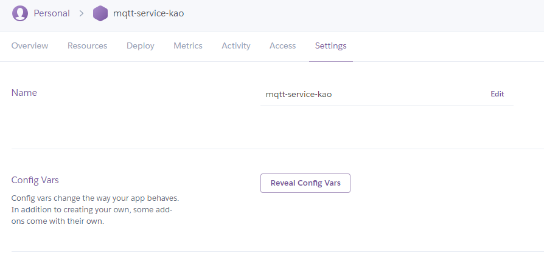

Whenever someone talks about the internet of things the cloud is not far. And
just as the real thing the cloud in this context has no clear outline. It's one
of the buzzwords carrying the heavy burden of being suitable for marketing.

I personally like the definition of of the cloud as a way to hand over the
responsibility to manage own servers or services to another entity. It ranges
from managed machines, where you still have to care about everything above the
operating system, to ready to use pieces of software like
[cloudmqtt](https://www.cloudmqtt.com). In modern software development the
managed machines are loosing relevance and managed platforms capable of running
individual software packed in standardized containers like
[Docker](https://docker.com) are getting more important. Besides
containerization many platform providers also have a way to just upload the code
and decide on the project structure what to run. For example a node program has
a `package.json` file describing all dependencies and there are convention based
default "scripts" listed like `build`, `test` and `start`.

If you don't have some really extreme requirements you can freely choose from
almost every provider on the market. There are of course the big software
companies like Amazon, Microsoft and Google with their cloud platforms but for
small projects or experimentation a really good and also free alternative is
[heroku](https://heroku.com). On the
[devcenter.heroku.com/](https://devcenter.heroku.com/) site there are a lot of
tutorials explaining how to run and deploy software written in different
languages. Here I will concentrate on the node.js platform and how to transfer
the mqtt data server from last session into the cloud. So this will be a short
summary of the heroku
[deploying-nodejs-tutorial](https://devcenter.heroku.com/articles/deploying-nodejs).

## Running Node.js on Heroku

### Prerequisites

- An Heroku account [signup.heroku.com](https://signup.heroku.com)
- The Heroku CLI [cli.heroku.com/](https://cli.heroku.com/)
- git [git-scm.com/downloads](https://git-scm.com/downloads) (here is a short
  [guide to the git fundamentals](http://rogerdudler.github.io/git-guide/))

As you might already have thought by the mentioning of git the deployment of a
Node.js app to Heroku is based on the versioning tool. So the first step should
be to prepare your project to work well with git. The most important part here
is to tell git which files should be ignored and don't have to be tracked
(mainly the node_modules folder). To do so just add a file called `.gitignore`
to your project folder, and list all files and folders you want to ignore:

```gitignore
# Dependency directories
node_modules/
jspm_packages/

# Logs
logs
*.log
npm-debug.log*
yarn-debug.log*
yarn-error.log*

# =========================
# Operating System Files
# =========================

# OSX
# =========================

.DS_Store
.AppleDouble
.LSOverride

# Thumbnails
._*

# Files that might appear on external disk
.Spotlight-V100
.Trashes

# Directories potentially created on remote AFP share
.AppleDB
.AppleDesktop
Network Trash Folder
Temporary Items
.apdisk

# Windows
# =========================

# Windows image file caches
Thumbs.db
ehthumbs.db

# Folder config file
Desktop.ini

# Recycle Bin used on file shares
$RECYCLE.BIN/

# Windows Installer files
*.cab
*.msi
*.msm
*.msp

# Windows shortcuts
*.lnk
```

After the preparation for git you can initialize a git repository inside this
folder with the `git init` command. With the `git add *` command all files with
a change are "staged", the `git commit -m "Commit message"` finally adds the
changes to the version history of the repository. Although it is important to
know those fundamentals and basic git commands it is a lot easier to use with a
graphical user interface, like the one embedded in visual studio code.

The next step is important for Heroku to digest your project. The used
dependencies are already listed in the package.json and will be installed
automatically:

```json
  ...
  "dependencies": {
    "mqtt": "^2.18.8",
    "micro": "^9.3.3",
    "ip": "^1.1.5"
  }
  ...
```

Now it is important to tell Heroku how to start the server application, that's
done by adding the "start" script, which should already be present in the mqtt
project from the "micro" package which uses the main file from the project to
start a microservice, but the command needs the parameter to know on which port
to listen:

```json
  ...
  "main": "index.js",
  "scripts": {
    "micro -l tcp://0.0.0.0:$PORT"
  },
  ...
```

As the last step tell Heroku what version of Node.js to use:

```json
...
  "engines": {
    "node": "11.x"
  },
...
```

Now with all this information it's time to work with heroku itself. Use the
command `heroku login` to authenticate with your personal account. To create a
new app you can either use the web-interface
[dashboard.heroku.com/new-app](https://dashboard.heroku.com/new-app) or the cli
with the command `heroku create`. The CLI command automatically links the remote
git repository used for deployment. If you used the web-interface you still have
to link it by using the `heroku git:remote -a HEROKU_APP_NAME` command.

Before you start committing all changes to your git repository you have to make
sure to remove all account information from your code. Once it is under version
control it is hard to get rid of the publicly available information. A good way
to do so is replacing the hard coded values with references to environment
variables. On Node.js you can access the environment through
`process.env.YOUR_VARIABLE_NAME`.

 You can
edit the environment variables for your heroku app in the web interface.

Now you can deploy your application to a server managed by Heroku with just one
command:

```shell
git push heroku master
```

### Tasks

- replace any account information in your code with environment variables
- prepare your mqtt-server project folder for git and heroku
- create a new heroku app
- run your application on heroku
