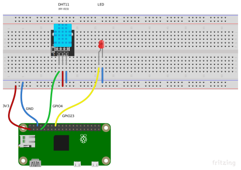

One of the most common use cases of IoT is reading and collecting sensor data.
Here I will show an example using the DHT11 sensor which reads the temperature
and humidity values in its environment.

A simple setup would look like this, the sensor is connected with its data pin
to the GPIO pin 4 and an error led is connected to the GPIO pin 23, it shall
blink when there is an error.



To address the sensor from node there is another dependency which has to be
installed. The [`node-dht-sensor`](https://github.com/momenso/node-dht-sensor)
package uses the [BCM2835](https://www.airspayce.com/mikem/bcm2835/) library. To
install this library connect to your Raspberry Pi via ssh and start by
downloading the current library version (1.57) after downloading unpack and
install it:

```shell
wget https://www.airspayce.com/mikem/bcm2835/bcm2835-1.57.tar.gz
tar zxvf bcm2835-1.57.tar.gz
cd bcm2835-1.57
./configure
make
sudo make check
sudo make install
```

With the BCM2835 library installed the project setup can continue. As you
already did for the blinky app create a new folder `~/sensors01` in your home
folder on the Raspberry Pi. This folder will be used as target to transfer the
files over `scp`.

On your normal computer start a new project and add a `package.json`:

```json
{
  "name": "sensors01",
  "scripts": {
    "start": "node index.js"
  },
  "dependencies": {
    "axios": "^0.18.0",
    "node-dht-sensor": "^0.0.34",
    "onoff": "^3.2.2",
    "sleep-promise": "^8.0.1",
    "yargs": "^12.0.2"
  }
}
```

The listed dependencies are :

- [axios](https://www.npmjs.com/package/axios) - a package for easier http
  requests
- [node-dht-sensor](https://www.npmjs.com/package/node-dht-sensor) - used to
  read the DHT sensor
- [onoff](https://www.npmjs.com/package/onoff) - for easy access to the gpio
  pins
- [sleep-promise](https://www.npmjs.com/package/sleep-promise) - awaitable sleep
  function
- [yargs](https://www.npmjs.com/package/yargs) - simplifies access to arguments
  used to start the program

As a start for your sensor reading program you can use this code:

```js
const sensorLib = require('node-dht-sensor')
const Gpio = require('onoff').Gpio
const sleep = require('sleep-promise')
const yargs = require('yargs')
const axios = require('axios')

const args = yargs.options({
  backend: { alias: 'b' },
  interval: { alias: 'i', default: 5000 },
  verbose: { alias: 'v', default: false, boolean: true },
}).argv

console.log(
  `starting reading of sensor data with backend: ${
    args.backend
  } and interval: ${args.interval}`
)

const errorLed = new Gpio(23, 'out')

// local state holding variable used to indicate some kind of error
let deviceHasError = false
/**
 * function to let an led connected to the pin 23 blink frantically
 * runs as long as the `deviceHasError` state is true
 */
async function errorBlink() {
  errorLed.writeSync(1)
  await sleep(100)
  errorLed.writeSync(0)
  await sleep(100)

  if (deviceHasError) {
    errorBlink()
  }
}

/**
 * some data to describe the connected DHT sensor
 * type can be 11 or 22, it depends on the device
 * the number of the gpio pin connected to the data pin of the sensor
 */
const dhtSensor = {
  type: 11,
  pin: 4,
  name: "Kalle's DHT11",
}

/**
 * function which tries to send the given data to the server,
 * which is set through the `--backend` start argument
 * @param {*} params data to send to the server
 */
async function postDataToServer(params) {
  try {
    // TODO: send the data as JSON to the server
    if (args.verbose) {
      console.log('sent sensor data to server')
    }
  } catch (e) {
    console.error('failed sending sensor data to server', e)
  }
}

/**
 * function which reads the sensor values and sends them to the server
 * after waiting for the specified interval time it calls itself to run again
 */
async function readSensor() {
  sensorLib.read(
    dhtSensor.type,
    dhtSensor.pin,
    (error, temperature, humidity) => {
      // TODO: check if there is an error
      // TODO: if the sensor values are valid send them to the backend
    }
  )

  // wait for the given interval
  await sleep(args.interval)
  // start over
  readSensor()
}

// kick of the sensor reading
readSensor()
```

Now it's time to bring some internet to the things, the program above needs a
server to send the collected data to. For an easy start the server should be as
simple as possible. I recommend using a library made for micro-services called
[micro.js](https://github.com/zeit/micro), it lets you build single purpose
servers easily.

To begin working on the server create another project and start with this
package.json:

```json
{
  "name": "sensorServer01",
  "main": "index.js",
  "scripts": {
    "start": "micro"
  },
  "dependencies": {
    "micro": "^9.3.3",
    "ip": "^1.1.5"
  }
}
```

The listed dependencies are :

- [micro](https://www.npmjs.com/package/micro) - package to create
  micro-services
- [ip](https://www.npmjs.com/package/ip) - package to get simple access to own
  ip

As a starting point for the server you can use the following script:

```js
const { promisify } = require('util')
const { json, send } = require('micro')
const ip = require('ip')
const fs = require('fs')

const writeFileAsync = promisify(fs.writeFile)
const existsFileAsync = promisify(fs.exists)

const DATA_FILE = './sensorReadings.json'

/**
 * tries to read the json data stored in the
 * ./sensorReadings.json file, if it fails an
 * empty array is returned
 */
async function readData() {
  let data = []
  if (await existsFileAsync(DATA_FILE)) {
    try {
      data = require(DATA_FILE)
    } catch (e) {
      console.error('failed reading file', DATA_FILE, e)
    }
  }
  return data
}

/**
 * Writes the collected data as a stringified json object
 * to the ./sensorReadings.json file
 * @param {Array<any>} data
 */
async function writeData(data) {
  await writeFileAsync(DATA_FILE, JSON.stringify(data))
}

console.log('started sensor data collection service')
console.log('running at ', `http://${ip.address()}:${process.env.PORT || 3000}`)

/**
 * If the server gets a POST request read the posted json data and store it
 * if it is a GET request send the collected data to the client
 * @param {import("http").IncomingMessage} req
 * @param {import("http").ServerResponse} res
 */
module.exports = async function handleRequest(req, res) {
  const data = await readData()

  if (req.method === 'GET') {
    // TODO: send the collected data to the client
  } else if (req.method === 'POST') {
    // TODO: add the newly collected data to the data array
    // TODO: send a success code to the client
  }
}
```

### Tasks

- prepare the Raspberry Pi with the installation of the
  [BCM2835](https://www.airspayce.com/mikem/bcm2835/) library
- connect a DHT11 sensor with the Raspberry Pi
- connect a LED with the Raspberry Pi as an error signal
- extend the program running on the RPi to read temperature and humidity values
  from the DHT11 sensor
- create a server to collect data posted to it
