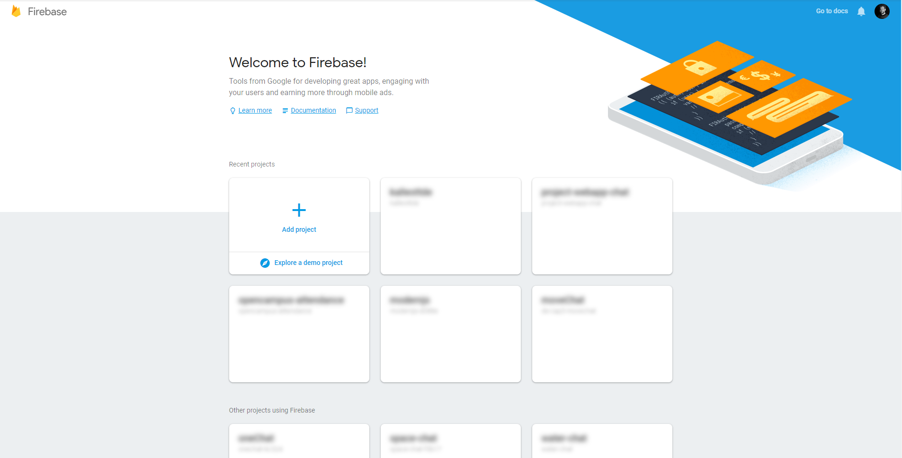
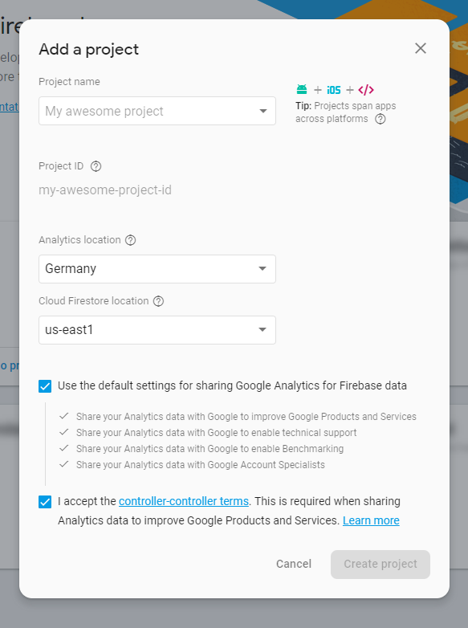
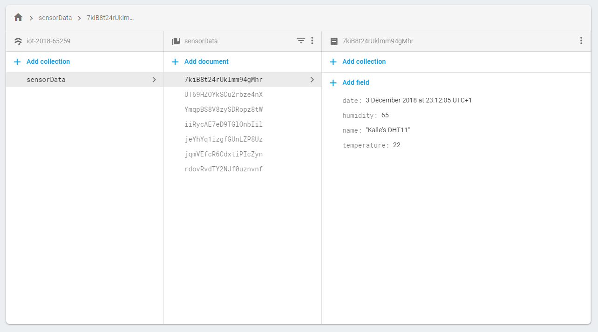

After bringing the software to the cloud last week, this session is all about
the next buzzword: Serverless.

Like the "cloud", "serverless" is also a very vague definition and to make it
clear from the start, yes there are running servers to run your serverless code.
The term serverless describes more the way the services you develop are written,
it's one more step on the abstraction layer. I see two ways to do serverless
development, the first is based on SaaS products and basically plug and play of
different tools. The second one is referenced as functions running in the cloud,
which is more of an architecture decision than a new cloud technology. For
larger projects these principles enable you to have a very granular and precise
encapsulation of responsibility. For smaller projects serverless development
enables you to get running really fast, because you don't have to care about any
platform or infrastructure. On the other hand giving away all these decisions
also strips away flexibility, so always think carefully about your needs before
you set down on one tech-stack.

For this course and our sensor project we will use
[firebase](https://firebase.google.com/), a service by google, which also has a
generous free plan. After authenticating with your google account you can open
the [firebase console](https://console.firebase.google.com/) to manage your
projects.



When you add a new project to your firebase account you can decide on some
privacy and location settings for your service. But to host some functions, at
the moment only the us locations are viable.



With firebase you get an all in one service providing solutions for
authentication, database, storage, hosting, functions and even machine learning
capabilities. For the sensors project only collects data from the connected
sensors so the first migration step from the still file-system based storage
solution on heroku is to create a database for your firebase project. To do so
select the "Database" section and create a new firestore database (if you aren't
sure what you are doing start in locked mode).

To use this database you need the
[firebase-admin](https://www.npmjs.com/package/firebase-admin) dependency. And
you should create a new service account by going to google
[cloud admin area](https://console.cloud.google.com/iam-admin/serviceaccounts)
of your project. The new service account should have the editor role to be able
to write data. On the last step create a json key file which will be used to
authenticate to the database from the node process. Save the json file to the
project folder and add it to a `.gitignore` file to prevent adding it to a
repository.

Before you start working on the actual program you should start by creating the
new project on the Raspberry Pi:

```json
{
  "name": "firebase-device",
  "scripts": {
    "start": "node index.js"
  },
  "dependencies": {
    "node-dht-sensor": "^0.0.34",
    "onoff": "^3.2.2",
    "sleep-promise": "^8.0.1",
    "yargs": "^12.0.5",
    "firebase-admin": "^6.3.0"
  }
}
```

Unfortunately right now the protocol ([gRPC](https://grpc.io/)) to transfer data
to and from firebase is not directly compatible with Node.js on ARMv6 and has to
be built on the device. After running `npm install` in the project folder run
the command

```bash
npm rebuild --build-from-source grpc
```

The rebuild process takes some time (especially on the Raspberry Pi) so I have
prepared a zipped `node_modules` folder with the installed and rebuild
dependencies for node `v10.14.1` and `v11.1.0`

##### [node_modules-node10-grpc-armv6.tar.gz](https://github.com/kaoDev/kalleott.de/raw/prebuilt_archives/samples/firebase-device/node_modules-node10-grpc-armv6.tar.gz)

```bash
curl -o node_modules-node10-grpc-armv6.tar.gz https://github.com/kaoDev/kalleott.de/raw/prebuilt_archives/samples/firebase-device/node_modules-node10-grpc-armv6.tar.gz
tar -zvxf node_modules-node10-grpc-armv6.tar.gz -C ./
```

##### [node_modules-node11-grpc-armv6.tar.gz](https://github.com/kaoDev/kalleott.de/raw/prebuilt_archives/samples/firebase-device/node_modules-node11-grpc-armv6.tar.gz)

```bash
curl -o node_modules-node11-grpc-armv6.tar.gz https://github.com/kaoDev/kalleott.de/raw/prebuilt_archives/samples/firebase-device/node_modules-node11-grpc-armv6.tar.gz
tar -zvxf node_modules-node11-grpc-armv6.tar.gz -C ./
```

Now that all dependencies are able to run on the device you can start to setup
the connection to the "Firestore" database.

```js
// load the firebase dependency
const firebase = require('firebase-admin')

// load the certificate data created in
// https://console.cloud.google.com/iam-admin/serviceaccounts
// the account needs write access
const serviceAccount = require('./firebase-key.json')

// initialize firebase app with authentication data
firebase.initializeApp({
  credential: firebase.credential.cert(serviceAccount),
})

// get the reference to the firebase database
const db = firebase.firestore()
// set timestampsInSnapshots in the settings
// (needed to prevent some legacy warnings)
db.settings({
  timestampsInSnapshots: true,
})
```

Writing data with firestore is pretty straight forward, you just choose a
collection to write to and then either add or set the data:

```js
/**
 * takes the sensor values for temperature and humidity and the name
 * of the source sensor
 *
 * @param {number} temperature
 * @param {number} humidity
 * @param {string} name
 */
async function writeData(temperature, humidity, name) {
  try {
    await db.collection('sensorData').add({
      temperature,
      humidity,
      name,
      // let the database create a timestamp
      date: firebase.firestore.FieldValue.serverTimestamp(),
    })
  } catch (e) {
    console.error('error writing to firestore', e)
  }
}
```

In the firebase console you can now see data added live to your database:



### Tasks

- create a firebase app to manage your sensor data
- extend the program running on the Raspberry Pi to write data to the Firestore
