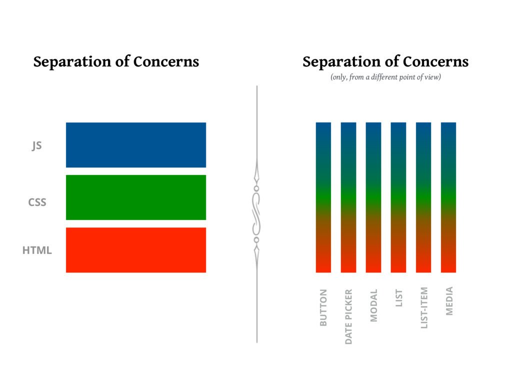

The classic approach to styling in the browser is creating a
css file and provide it with a `<link />` tag. The tutorial
from last session also worked with an external css file, but
linked it by adding a JS `import` statement. The benefits of
this way are an easy separation of concerns and the already
known workflow of styling html elements.

But the separation of concerns also leads to another path.
In react an application is separated into components, but
the workflow of defining global style-classes is quiet
contrary. So why not rethink it?

[Christiano Rastelli](https://twitter.com/areaweb) made this
wonderful graphic, which shows a new way of drawing
boundaries in a component oriented application architecture.



By separating the architecture in this way, a component
becomes responsible for its behavior (JS), layout (html) and
design (css). All these concerns should only be influenced
by the component itself.

One viable solution is to use normal css rules with unique
style rules for every component. For very small projects
this approach is well suited but as soon as a project
becomes a bit larger and the component count rises it gets
harder and harder to name the css rules in its global
namespace. To eliminate this downside of css the simplest
solution is to just use inline styling.

```jsx
const Title = props => (
  <h1
    style={{
      fontSize: '1.5em',
      textAlign: 'center',
      color: 'forestgreen',
    }}
    {...props}
  />
)
```

It is simple, but some important features are missing (for
example media-queries and keyframe animations) and it's not
as performant as css-class-rules.

The solution: Take the best from both worlds!

Write the style rules in JavaScript, but generate
class-rules. The most commonly used library to support this
workflow is
[styled-components 💅](https://github.com/styled-components/styled-components),
which enables you to define components, only containing
information about the element type and styling. Those are
very well suited as the basic building blocks of any web
app. To work with, the styled component lib provides a
[tagged template literals](https://www.styled-components.com/docs/advanced#tagged-template-literals)
factory for each html base element.

```jsx
import styled from 'styled-components'

const Title = styled.h1`
  font-size: 1.5em;
  text-align: center;
  color: forestgreen;
`
```

It's even possible to generate style depending on the
component props by inserting functions into the template
string.

```jsx
import styled from 'styled-components'

const Title = styled.h1`
  font-size: 1.5em;
  text-align: center;
  color: forestgreen;

  ${props =>
    props.primary &&
    css`
      background: forestgreen;
      color: white;
    `};
`
```

This string based generation of styles has the benefit of
common syntax, if you know css. But in comparison to writing
simple objects it can get cumbersome if you are working with
many variables.

Like always in the JavaScript world, if there is a problem,
there will be a lib. For this case
[glamorous 💄](https://github.com/paypal/glamorous)
delivers. It has an api quiet similar to styled-components
but instead of working with template-strings you define the
styles like the react inline styles as objects. For more
complex scenarios the component generator function can take
multiple arguments, either a style object or a function
returning a style object.

```jsx
import glamorous from 'glamorous'

const Title = glamorous.h1(
  {
    fontSize: '1.5em',
    textAlign: 'center',
    color: 'forestgreen',
  },
  props =>
    props.primary && {
      background: 'forestgreen',
      color: 'white',
    },
)
```

Last but not least
[emotion](https://github.com/emotion-js/emotion) should be
mentioned. This lib enables you to work with both
template-strings and objects.

```jsx
import styled from 'react-emotion'

const Title = styled('h1')`
  font-size: 1.5em;
  text-align: center;
  color: ${props => (props.primary ? 'white' : 'forestgreen')} forestgreen;
  background: ${props => (props.primary ? 'forestgreen' : 'unset')};
`
```

```jsx
import styled from 'react-emotion'

const Title = styled('h1')(
  {
    fontSize: '1.5em',
    textAlign: 'center',
    color: 'forestgreen',
  },
  props =>
    props.primary && {
      background: 'forestgreen',
      color: 'white',
    },
)
```

### Tasks

- clone the
  [chat-app-start](https://github.com/kaoDev/chat-app-start)
  repository and start the dev-server (`npm start`)
- choose one of the styling approaches
  [styled-components](https://www.styled-components.com/docs/basics#installation),
  [glamorous](https://glamorous.rocks/),
  [emotion](https://emotion.sh/docs/install) and install
  needed dependencies
- start styling the `User` and `Message` components, you can
  find some inspiration on
  [dribble](https://dribbble.com/search?q=chat+ui) or
  [google images](https://www.google.de/search?q=chat+ui+example&tbm=isch)
