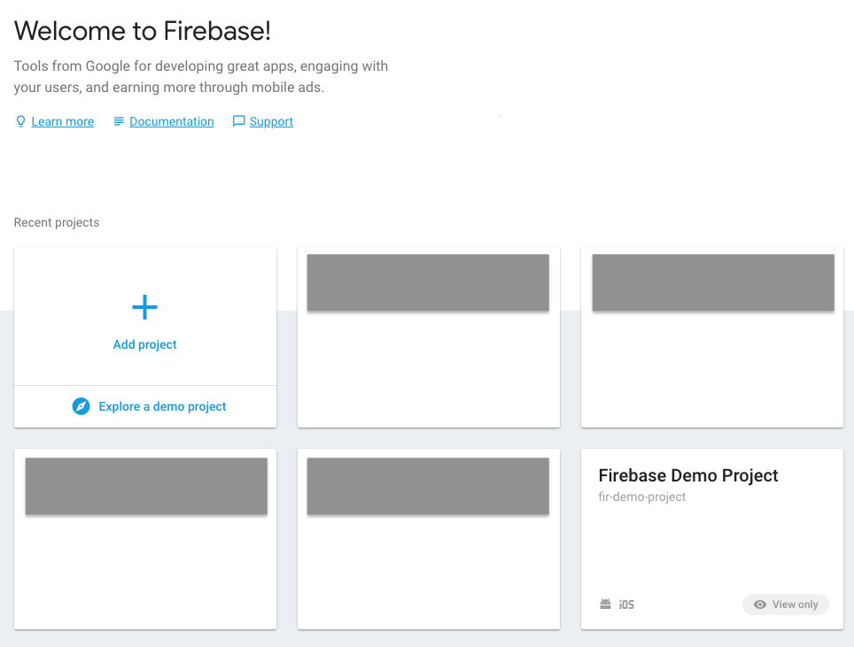

Till now the chat app is quite boring, because you can only
talk to yourself. But for synchronization of the message
history with other computers you need some external service
to store the data and send notifications about changes.
Firebase delivers an all inclusive solution with a realtime
database capable of syncing datasets to all connected
clients.

The first step to get running is to
[create a new firebase app](https://console.firebase.google.com/u/0/)
(or login with a google account). If you are logged in you
should see something like this in the firebase console:



The "Add project" button opens a wizard with some questions
about your project, select what is fitting for you (region,
data sharing with google...). After creating the app the
only part missing is the database to enable data storage for
your project click on "GET STARTED" on the Database tile and
on the next screen select "Realtime Database". For the sake
of simplicity select "start in **test mode**" but be aware
to change the permissions as soon you go public with your
app
([rules documentation](https://firebase.google.com/docs/database/security/)).
Additionally to the database the chat needs some kind of
authentication to match messages to users. For the example
anonymous authentication is enough to enable it select
"Authentication" in the firebase app console. Unter the
"SIGN-IN METHOD" tab you can select the Anonymous provider
and set it to enabled.

That's it. Everything else is defined in the app code.

So next step is to install firebase:

`npm install firebase`

In the firebase console of your app you can get all config
information when you click on "Add Firebase to your web
app". To initialize the app import `initializeApp` from the
package and call it with the copied config information:

```js
import { initializeApp } from 'firebase'

const config = {
  apiKey: 'YOUR_API_KEY_HERE',
  authDomain: 'AUTH_DOMAIN',
  databaseURL: 'DATABASE_URL',
  projectId: 'PROJECT_ID',
  storageBucket: 'STORAGE_BUCKET_URL',
  messagingSenderId: 'MESSAGING_SENDER_ID',
}

const app = initializeApp(config)
```

In the chat-app are two collections of data, users and
messages. Each collection with its own rules how to write
and read data.

All database requests begin with the same pattern, at first
you need a reference of the data you want to work with.

```js
import { database } from 'firebase'

database(app).ref(`path/to/the/peace/of/data`)
```

The built up data-reference can get more specified with some
query-functions like `limitToLast(numberOfEntries)` or
`orderByChild(childKey)`. When the query is fine you can use
different functions to execute it, `once(event_type)` for is
single time data-fetch, `on(event_type, callback)` for
continuos updates, `set(data)` to update/create the data at
the specified ref-adress, `push(data)` to create a new entry
in this collection.

The functions to read and write userData are then defined as
this:

```js
const USERS_REF_NAME = 'users'

export async function getUser(userId) {
  return (await database(app)
    .ref(`${USERS_REF_NAME}/${userId}`)
    .once('value')).toJSON()
}

export async function writeUserData(userId, name, profilePic) {
  await database(app)
    .ref(`${USERS_REF_NAME}/${userId}`)
    .set({
      id: userId,
      name,
      profilePic,
    })
}
```

In combination with the anonymous authentication, every
client can create its own user or retrieve the stored
user-data for its own generated id:

```js
export async function getOrCreateAnonymousUser() {
  const anonymous = (await auth(app).signInAnonymously()).user

  let dbUser = await getUser(anonymous.uid)

  if (!dbUser) {
    await writeUserData(anonymous.uid, '', '')
    dbUser = await getUser(anonymous.uid)
  }

  return dbUser
}
```

To observe changing data is a little more complicated.
Besides providing the callback to handle update you have to
provide some teardown logic. Like registerd event listeners
you can remove a callback by calling
`.off(event_type, callback)` on the data-ref.

Creating an observable from the users collections then looks
like this:

```js
export function usersObservable() {
  return new Observable(observer => {
    const callback = dataSnapshot => {
      const usersJson = dataSnapshot.toJSON() || {}

      const userArray = Object.keys(usersJson).map(userId => usersJson[userId])

      observer.next(userArray)
    }

    // notify observer on value changes
    database(app)
      .ref(USERS_REF_NAME)
      .on('value', callback)
    // return unsubscribe function
    return () => {
      database(app)
        .ref(USERS_REF_NAME)
        .off('value', callback)
    }
  })
}
```

The constructed observable emits a new value (array of
users), each time the collection in the database changes.

The complete implementation of the chat logic is available
in the
[chat-app-3 repository](https://github.com/kaoDev/chat-app-3).

### Tasks:

- checkout the
  [chat-app-3 repository](https://github.com/kaoDev/chat-app-3)
  (don't forget to npm install)
- get familiar with the Login component
- get familiar with the firebase logic
- extend the users data-model with a last-seen flag (update
  the user every time when there is some relevant action in
  the app)
- show a list of all registered users ordered by the time
  they were last seen
